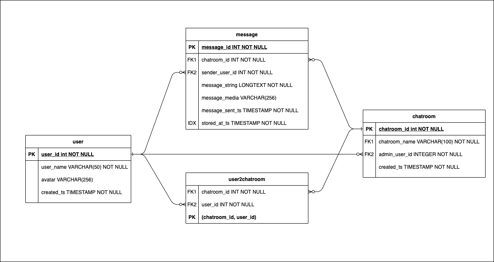

# Guild Education Messenger API

## Assignment Instructions
1. A short text message can be sent from one user (the sender) to another
(the recipient).
2. Recent messages can be requested for a recipient from a specific sender
- with a limit of 100 messages or all messages in last 30 days.
3. Recent messages can be requested from all senders - with a limit of 100
messages or all messages in last 30 days.
4. Document your api like you would be presenting to a web team for use.
5. Show us how you would test your api.
6. Ensure we can start / invoke your api.

## Project

### Makefile
I've included a Makefile to run handy dev commands.

- `make setup`: Create virtualenv.
- `make install`: Install necessary dependencies.
- `make lint`: Check code quality.
- `make test`: Run functional tests. Returns results and code coverage.
- `make example-setup`: An example setup that will generate a chatroom, users and messages.
- `make start-api`: Run the Flask API.  It can be accessed at `localhost:5000`.


### Start/Invoke the API
After setup (`make setup`), you may also need to activate the virtual environment.
```
source .venv/bin/activate
```
Then run `make install`.

You'll then start the API by running: `make start-api`.

#### Using the API
You can either use curl, a browser, or Postman to interact with the application.

##### Example curl
```
curl -d '{"data": [{"message_str": "hello", "message_sent_ts": 1637029963, "sender_user_id": 2}]}' -H 'Content-Type: application/json' localhost:5000/chatrooms/1/messages
```


### Routes

#### Available Endpoints

##### `/chatrooms/<chatroom_id>/messages POST`
Store new messages in a particular chatroom.

```
Input JSON Payload:
    {
        data: [
            {
                message_str: string
                message_sent_ts: int(timestamp)
                sender_user_id: int
            },
            ...
        ]
    }

JSON Response:
    {
        data: [
            {message_id: <MESSAGE_ID>},
            ...
        ]
    }
```

#### Unavailable Endpoints
I wasn't able to complete all endpoints in the time allotted, but here were some ideas that I had.

##### `/chatrooms/<chatroom_id>/messages GET`
Get all messages in a particular chatroom.

##### `/chatrooms/<chatroom_id>/messages/<sender_user_id> GET`
Get all messages in a particular chatroom from a particular sender.

##### `/chatrooms GET`
Get all chatrooms.

##### `/chatrooms POST`
Create a new chatroom.

##### `/chatrooms/<ID> GET`
Get details on particular chatroom.

##### `/chatrooms/invite POST`
Add users to a particular chatroom.

##### `/users GET`
Get all users.

##### `/users POST`
Create new user.

##### `/users/<ID>/chatrooms GET`
Get chatrooms that a particular user is in


### Technical Documentation

#### Architecture
This service only provides the Flask REST API and a sqlite datastore. I used sqlite since it's built into Python and is a lightweight store for this project.


##### Redis?
As a more complete application, I thought about using Redis to maintain each users status. I'd provide an endpoint that client's can use to update the users status.
We'd use Redis since the user status would be updated much more frequently and would need faster read/write responses.

##### Media Service/Store?
I also considered having a service and store for media included on particular messages.
We'd need a service (possibly using Lambda) to upload a copy of the media to our own store (something like S3).
We could also upload and reference user avatars.

#### Data store
I used sqlite since it's built into Python and is a lightweight store for this project.
There are 4 tables used to organize the data for this application.
The chatroom is where each user congregates and sends messages to eachother.
These messages are associated to a particular chatroom and sent by a particular user.
Users can be in multiple chatrooms.



##### user
Maintains user data for each user of the messenger application.

##### chatroom
Maintains the chatroom that users send messages to eachother in.

##### message
Each message written by a particular user to other users in a particular chatroom.

##### user2chatroom
Relational Table that maintains each user who is in each chatroom.

#### Testing

##### sqlite file
You can run SQL directly against the DB by opening the db file using `sqlite3`. The default db file is `messenger_app.db`.  This can be changed with an environment variable: `MESSENGER_DB_SQLITE_FILE`.

```
$ sqlite3 messenger_app.db
SQLite version 3.22.0 2018-01-22 18:45:57
Enter ".help" for usage hints.
sqlite> SELECT * FROM message;
1|1|10|hello world!||1637029263|2021-11-16 05:09:31
2|1|1|hello world!||1637029263|2021-11-16 05:12:46
3|1|1|hello world!||1637029263|2021-11-16 05:16:29
4|1|1|hello world!||1637029263|2021-11-16 05:16:40
5|1|1|hello world!||1637029263|2021-11-16 05:17:09
6|1|2|bye world!||1637029264|2021-11-16 05:17:09
7|1|2|hello||1637029963|2021-11-16 07:02:17
```

##### Functional tests
I wrote some functional tests. Since I didn't have much time, I decided to write functional tests instead of unit so I could cast a wider test net.

You can run the tests via `make test`.

The output will show you the results of the tests that I wrote and the test coverage.


##### Example Setup
I also created an example setup that demonstrates the relationshop between each entity.

Run `make example-setup`, then reference `example.db`.

The example setup creates users, a chatroom, invites users to the chatroom, then generates messages in the chatroom.
```
$ sqlite3 example.db
SQLite version 3.22.0 2018-01-22 18:45:57
Enter ".help" for usage hints.

sqlite> SELECT * FROM message;
1|1|1|hello||2021-01-10 13:01:10|2021-11-16 07:47:07
2|1|2|hi. how are you?||2021-01-10 13:01:10|2021-11-16 07:47:07
3|1|1|im well||2021-01-10 13:01:10|2021-11-16 07:47:07
4|1|1|how r u?||2021-01-10 13:01:10|2021-11-16 07:47:07
5|1|2|great!||2021-01-10 13:01:10|2021-11-16 07:47:07

sqlite> SELECT * FROM chatroom;
1|my chatroom|1|2021-11-16 07:47:07

sqlite> SELECT * FROM user;
1|aaron||2021-11-16 07:47:07
2|betty||2021-11-16 07:47:07
3|carol||2021-11-16 07:47:07

sqlite> SELECT * FROM user2chatroom;
1|1
1|2
1|3
```
